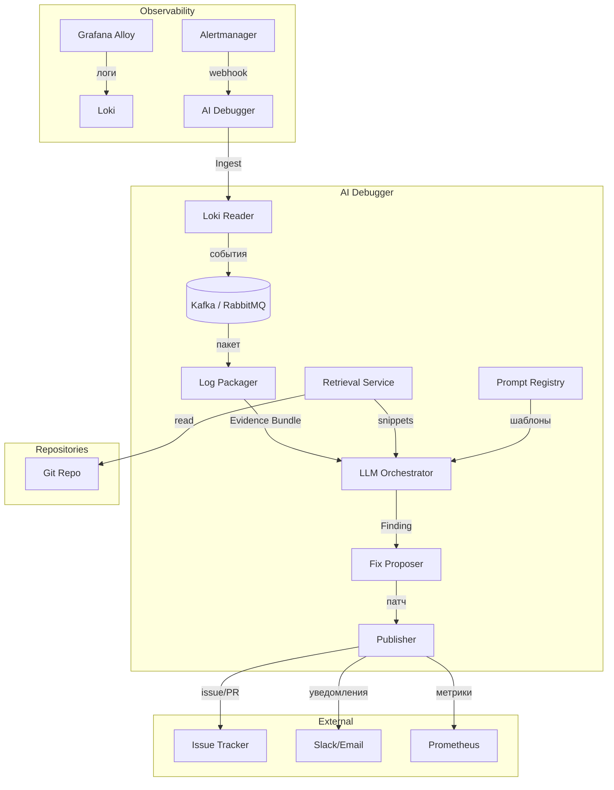

# AI Debugger — Финальная архитектура (LLM-first)

Этот документ фиксирует целевую архитектуру сервиса **AI Debugger**, который автоматически анализирует логи, находит первопричину ошибок с помощью LLM, подтверждает гипотезы кодом из репозитория и предлагает исправления. Архитектура построена на принципах **LLM-first**, **retrieval-augmented generation (RAG)** и строгого **code grounding**. Включены улучшения по итогам ревью, обеспечивающие надёжность, безопасность, экономичность и готовность к промышленной эксплуатации.

---

## 1. Цели и принципы

### Цели
- **Root‑cause analysis**: автоматическое определение первопричины в цепочке событий.
- **Code‑grounded выводы**: каждое утверждение подтверждено фрагментом кода из репозитория.
- **Стабильный дедуп**: один класс проблемы → один `fingerprint` (устойчив к незначительным изменениям стека).
- **Автоматизация**: от забора логов до создания issue/PR без ручного вмешательства.
- **Обратная связь**: механизм сбора оценок разработчиков для непрерывного улучшения.

### Принципы
- **LLM-first**: модель управляет анализом, сервис предоставляет контекст и инструменты.
- **Retrieval, не «всё репо»**: модель получает только необходимые фрагменты кода через поиск.
- **Guardrails**: строгие ограничения на автофиксы, обязательная CI‑валидация.
- **Безопасность по умолчанию**: минимальные привилегии, маскирование PII, поддержка on‑prem и локальных LLM.
- **Идемпотентность**: повторные обработки не плодят дубликаты issue/PR.

---

## 2. Общая схема и потоки данных



**Основные потоки:**
1. **Ingest**: периодически или по алерту читает логи из Loki, публикует нормализованные события в очередь.
2. **Log Packager**: читает события, группирует по корреляции, маскирует PII, формирует **Evidence Bundle** (сжатый пакет доказательств).
3. **LLM Orchestrator**: используя промпт из **Prompt Registry**, анализирует Bundle, запрашивает у **Retrieval Service** фрагменты кода, строит обоснованное заключение.
4. **Fix Proposer**: при наличии guardrails генерирует патч и проверяет его синтаксис.
5. **Publisher**: создаёт или обновляет issue, опционально PR, отправляет уведомления и метрики.

---

## 3. Компоненты (детально)

### 3.1 Ingest (Loki reader)
**Назначение**: инкрементальное чтение логов из Loki с гарантией идемпотентности.  
**Улучшения против исходной архитектуры**:
- **Буферизация**: нормализованные события публикуются в Kafka/RabbitMQ (для MVP допустимо прямое взаимодействие).
- **Расширенный дедуп**: помимо `(stream_id, ts, line_hash)` учитывается offset лога (если доступен).
- **Политика повторных попыток**: exponential backoff при ошибках Loki.
- **Конфигурируемые LogQL запросы**: хранятся в БД, поддерживают параметризацию (`$__interval`).

**Хранение состояния**:
- `checkpoints` в Postgres: `query_id`, `last_processed_ts`, `watermark_seconds`, `last_offset`.

### 3.2 Log Packager
**Назначение**: преобразование потока событий в компактный Evidence Bundle, пригодный для LLM.  
**Улучшения**:
- **PII‑маскирование**: конфигурируемые правила (regex) для замены email, IP, телефонов и т.д. Применяется к `message` и `stacktrace`.
- **Нормализация stacktrace**: удаление номеров строк, путей сборки, параметров методов — для устойчивого fingerprint.
- **Семплинг с сохранением редкостей**: для fingerprint с низкой частотой сохраняются все события; для высокочастотных — репрезентативная выборка.
- **Формирование цепочек (chains)** : на основе `traceId`/`sessionId` строятся временные последовательности исключений.

**Выход**: `EvidenceBundle` — JSON-объект с ограничением по токенам (например, 15k токенов), включающий:
- агрегированную статистику (частоты, first/last seen),
- примеры stacktrace (до 5),
- цепочки событий,
- контекстные метки (сервис, версия, env).

### 3.3 Retrieval Service (Repo Access)
**Назначение**: предоставление LLM точного контекста кода через поиск и чтение фрагментов.  
**Улучшения**:
- **Семантический индекс** (tree‑sitter / Roslyn): извлекает определения и ссылки на символы (классы, методы, поля). Позволяет искать по fully qualified name.
- **Версионирование кода**: при запросе учитывается `version` из лога (тег/коммит). Кэширование нескольких последних версий.
- **Расширенный API**:
  - `search_symbol(query, filters)` — поиск символов по имени или части имени.
  - `get_symbol_definition(symbol_id)` — возвращает код объявления.
  - `get_references(symbol_id)` — список мест использования (для анализа race condition и т.п.).
  - `get_snippet(path, start_line, end_line, version)` — чтение кода.
- **Кэширование**: сниппеты кэшируются в Redis с инвалидацией по webhook из Git.

**Индексация**: инкрементальная, запускается при пуше в репозиторий. Для MVP допустим fallback на `git grep`.

### 3.4 LLM Orchestrator
**Назначение**: управление диалогом с LLM: анализ логов, запросы к retrieval, формирование структурированного вывода.  
**Улучшения**:
- **Prompt Registry**: версионированные шаблоны промптов, хранятся в Git или БД. Поддерживает A/B‑тестирование.
- **Стратегии выбора модели**: в зависимости от чувствительности данных и бюджета — облачная (GPT-4) или локальная (vLLM, Ollama).
- **Кэширование ответов**: по хешу `(EvidenceBundle, prompt_version)` — повторные инциденты не тратят токены.
- **Эвристический префильтр**: дешёвая модель или правила отсеивают заведомо неанализируемые ошибки (например, NRE без stacktrace).
- **Обработка ошибок LLM**:
  - Таймаут и лимит tool‑calls (макс. 20).
  - Валидация JSON‑ответа по схеме; при ошибке — повтор с указанием на нарушение.
  - Fallback‑модель (меньшего размера) при недоступности основной.

**Двухфазный процесс**:
1. **Log analysis**: модель изучает Evidence Bundle, определяет якорные кадры, строит гипотезу.
2. **Code grounding**: модель запрашивает фрагменты кода через retrieval, подтверждает гипотезу, документирует доказательства.

**Выход**: `Finding` — структурированный объект (причина, цепочка, severity, code evidence, suggested fix).

### 3.5 Fix Proposer
**Назначение**: трансляция рекомендации LLM в конкретный патч (опционально).  
**Улучшения**:
- **Allowlist правил**: конфигурационный YAML в репозитории (например, разрешённые паттерны: «добавить null‑check», «обернуть lock»). Условные правила (только для сервиса X).
- **Валидация патча**: перед созданием PR запускается сборка и линтер в изолированном контейнере. При ошибке PR не создаётся, finding помечается.
- **Структурированный патч**: LLM возвращает не дифф, а набор операций (замена строки, вставка после N‑й линии), которые программно применяются к исходному файлу.

### 3.6 Publisher
**Назначение**: публикация результатов во внешние системы.  
**Улучшения**:
- **Идемпотентность**: один `fingerprint` → одна открытая issue; обновления добавляются комментарием.
- **Обратная связь**: в issue добавляются метки (`ai-debugger`, `verified`, `false-positive`). Разработчик может поставить реакцию, которая собирается в метрики.
- **Авто‑закрытие**: при мерже PR с ключевым словом `Fixes #issue` Publisher подписывается на webhook и обновляет статус `finding`.
- **Rate limiting**: соблюдение лимитов API GitHub/GitLab.

---

## 4. Модель данных (Postgres + объектное хранилище)

### 4.1 Ключевые сущности
**`fingerprints`** — устойчивый идентификатор проблемы.  
- Добавлены поля: `aliases` (JSONB) — другие варианты fingerprint, связанные семантически; `feedback_stats` (JSONB) — оценки точности.  
- Индекс по `(exception_type, normalized_frames)`.

**`events`** — только репрезентативные сэмплы (не все).  
- Партиционирование по `ts` (ежемесячно).  
- Для долгосрочного хранения — выгрузка в ClickHouse.

**`evidence_bundles`** — новая таблица (или S3‑ссылка в `findings`).  
- Содержит сжатый Evidence Bundle, переданный LLM.  
- Позволяет повторно проанализировать при изменении промпта.

**`findings`** — основной артефакт.  
- Добавлено: `prompt_version`, `llm_model`, `latency_ms`, `feedback_score`.  
- `suggested_fix` включает как текст, так и структурированный патч.

**`knowledge_base`** — успешные фиксы.  
- При закрытии issue/мерже PR фикс сохраняется в связке с `fingerprint`.  
- При повторном появлении сразу выдаётся готовое решение.

**`feedback`** — оценки разработчиков.  
- `finding_id`, `user`, `verdict` (true_positive, false_positive, partial), `comment`.

### 4.2 Миграции и версионирование
- Инструмент миграций (Flyway/Liquibase).  
- Все изменения схемы версионированы и применяются при деплое.

---

## 5. Протокол retrieval (tool calls)

Интерфейс между Orchestrator и Retrieval Service (JSON over gRPC/REST):

### 5.1 `SearchSymbol`
**Запрос**:
```json
{
  "repo_id": "msd@main",
  "query": "PushModalFrame",
  "kind": "method|class|field",
  "version": "v1.2.3"
}
```
**Ответ**:
```json
{
  "symbols": [
    {
      "id": "msd:Session.PushModalFrame",
      "name": "PushModalFrame",
      "full_name": "MSD.Core.Session.PushModalFrame",
      "kind": "method",
      "file": "Session.cs",
      "line": 42,
      "signature": "void PushModalFrame(ModalFrame frame)"
    }
  ]
}
```

### 5.2 `GetSymbolDefinition`
**Запрос**: `{ "symbol_id": "msd:Session.PushModalFrame", "version": "v1.2.3" }`  
**Ответ**: `{ "content": "...", "file": "...", "start_line": 42, "end_line": 55 }`

### 5.3 `GetReferences`
**Запрос**: `{ "symbol_id": "msd:_lockObject", "version": "v1.2.3" }`  
**Ответ**: `{ "references": [ { "file": "...", "line": 120, "snippet": "lock(_lockObject)" } ] }`

### 5.4 `GetSnippet`
**Запрос**: `{ "file": "Session.cs", "start_line": 40, "end_line": 60, "version": "v1.2.3" }`  
**Ответ**: `{ "content": "...", "lines": "40-60" }`

---

## 6. Безопасность и конфиденциальность

### 6.1 Маскирование PII (Log Packager)
- Реализуется через цепочку `MaskingProcessor`.  
- Конфигурация: набор regex‑правил с именованными группами, заменяемых на `[REDACTED]`.  
- Для stacktrace сохраняется структура, но удаляются пути локальной файловой системы.  
- Логируется факт маскирования (без данных).

### 6.2 Поддержка локальных LLM
- Абстрактный `LLMProvider` с реализациями: `OpenAI`, `Azure`, `Ollama`, `vLLM`.  
- Переключение через конфигурацию на уровне сервиса/окружения.

### 6.3 Безопасность внутренних API
- Взаимная аутентификация через mTLS или API‑токены.  
- Ролевая модель: сервис `Retrieval` имеет доступ только на чтение репозитория.

---

## 7. Наблюдаемость и эксплуатация

### 7.1 Метрики (Prometheus)
- `ai_debugger_ingest_lag_seconds` — отставание чтения из Loki.  
- `ai_debugger_events_processed_total`  
- `ai_debugger_llm_calls_total{model, status}`  
- `ai_debugger_llm_latency_seconds`  
- `ai_debugger_llm_cache_hits_total`  
- `ai_debugger_fingerprints_new_total`  
- `ai_debugger_findings_total{severity, status}`  
- `ai_debugger_feedback_accuracy` — скользящая точность по оценкам.  
- `ai_debugger_pr_created_total` и `ai_debugger_pr_ci_failure_total`

### 7.2 Алерты (Grafana)
- Высокий лаг ингеста (>5 мин)  
- Рост доли ошибок LLM (>5%)  
- Отсутствие новых finding за N часов  
- Падение точности обратной связи ниже порога

### 7.3 Дашборды
- Общая панель: активность, новые fingerprint, распределение severity.  
- Панель LLM: стоимость, токены, кэш, ошибки.  
- Панель обратной связи: точность по сервисам/версиям.

### 7.4 Health checks
- Эндпоинты `/live`, `/ready` для каждого компонента.  
- Graceful shutdown (завершение текущих задач).

---

## 8. Деплой и масштабирование

### 8.1 MVP (2–3 недели)
- Монолитное приложение (`ai-debugger`) с модульной структурой.  
- База данных: Postgres (управляемый сервис).  
- Кэш: Redis (опционально).  
- Отсутствие очереди — синхронная обработка.  
- Retrieval: `git grep` + индексация файлов (без AST).  
- Промпты: вшиты в код.  
- Локальные LLM не обязательны.

### 8.2 Этап масштабирования (3–6 месяцев)
- Выделение Retrieval Service в отдельный микросервис с семантическим индексом.  
- Внедрение очереди (Kafka) для буферизации событий.  
- Партиционирование Postgres, вынос логов в ClickHouse.  
- Prompt Registry с версионированием.  
- Knowledge base успешных фиксов.  
- Авто‑PR для allowlist‑паттернов.

### 8.3 Инфраструктура как код
- Terraform для облачных ресурсов.  
- Helm‑чарты для Kubernetes.  
- CI/CD через GitLab CI/GitHub Actions.

---

## 9. Дорожная карта внедрения

| Этап       | Содержание                                                                 | Ожидаемый результат                                 |
|------------|----------------------------------------------------------------------------|----------------------------------------------------|
| **MVP**    | Ingest из Loki, базовый fingerprint, LLM‑анализ (облачная модель), issue‑publisher, PII‑маскирование. | Рабочий прототип на 2–3 сервисах, дедуп, issue.   |
| **MVP+1**  | Устойчивый fingerprint, семантический поиск (AST), кэширование LLM, конфигурируемый allowlist, локальные LLM. | Повышение точности, снижение стоимости, готовность к on‑prem. |
| **Масштабирование** | Очередь, ClickHouse, авто‑PR, обратная связь, knowledge base.          | Промышленная эксплуатация на десятках сервисов.    |

---

## 10. Заключение

Представленная архитектура объединяет лучшие практики построения LLM‑ориентированных систем анализа отказов. Ключевые улучшения — **устойчивый fingerprint**, **семантический retrieval**, **гибкая система промптов**, **обратная связь** и **безопасность** — делают AI Debugger надёжным, экономичным и готовым к внедрению в крупных продуктовых компаниях. Последовательная реализация по этапам позволит быстро получить ценность на MVP и наращивать функциональность без переписывания ядра.

---

## Приложение A. Список репозиториев/пакетов (референсная структура)

Ниже — два допустимых варианта: **mono-repo** (проще старт) или **multi-repo** (проще владение по командам).

### Вариант A — mono-repo (рекомендуется для MVP)
Репозиторий: `ai-debugger/`

| Путь | Назначение |
|------|------------|
| `packages/ingest/` | Loki client (`query_range`, paging, retries), checkpoint manager (Postgres), LogQL query registry |
| `packages/packager/` | Извлечение exception-блоков, sampling/compaction, корреляция по `traceId/sessionId/threadId`, Evidence Bundle serializer |
| `packages/retrieval/` | Git fetch/clone (read-only), индексация (lexical + опц. semantic), API: `search_repo`, `fetch_snippet`, (опц.) `references` |
| `packages/llm-orchestrator/` | Шаблоны промптов, tool-call dispatcher (retrieval tools), двухфазный flow: log-analysis → code-grounding → fix plan |
| `packages/fix-proposer/` | Сборка патча (diff), allowlist guardrails, форматирование PR draft |
| `packages/publisher/` | Клиенты issue tracker (GitLab/GitHub/Jira), уведомления (Slack/Telegram), идемпотентность (fingerprint ↔ issue) |
| `packages/storage/` | Модели/миграции Postgres, утилиты Redis, клиент object storage (опц.) |
| `apps/api/` | REST API (findings, fingerprints, incidents) — опционально |
| `apps/worker/` | Scheduler + воркеры (ingest / analysis / publish) |
| `infra/` | Helm/K8s, Terraform, шаблоны секретов |

### Вариант B — multi-repo (для scale-out)
- **ai-debugger-core** — ingest, packager, orchestrator, модели storage
- **ai-debugger-retrieval** — индекс/поиск по репо как отдельный сервис
- **ai-debugger-publisher** — issues / PR / уведомления
- **ai-debugger-infra** — деплой

---

## Приложение B. Схема таблиц Postgres (минимальная, MVP)

Схема «как есть» для MVP-1. Важно сохранить: дедуп по `fingerprint`, чекпоинты по `query_id`, идемпотентность issue/PR.

### 1) `loki_queries`
Справочник LogQL-запросов («каналов»).

| Колонка | Тип | Описание |
|---------|-----|----------|
| `id` | TEXT PK | Стабильный идентификатор, напр. `msd_exceptions` |
| `name` | TEXT | |
| `logql` | TEXT | |
| `enabled` | BOOLEAN | |
| `created_at` | TIMESTAMPTZ | |
| `updated_at` | TIMESTAMPTZ | |

Индекс: `(enabled)`.

### 2) `checkpoints`
Прогресс чтения Loki.

| Колонка | Тип | Описание |
|---------|-----|----------|
| `query_id` | TEXT PK, FK → `loki_queries.id` | |
| `last_processed_ts` | TIMESTAMPTZ | До какого времени обработали |
| `watermark_seconds` | INT | Напр. 120 |
| `last_offset` | TEXT, nullable | Опц. offset Loki |
| `updated_at` | TIMESTAMPTZ | |

### 3) `fingerprints`
Ключ проблем.

| Колонка | Тип | Описание |
|---------|-----|----------|
| `fingerprint` | TEXT PK | Hash (exceptionType + normalized top frames) |
| `exception_type` | TEXT | |
| `top_frames` | JSONB | Нормализованные кадры (top N) |
| `first_seen_at` | TIMESTAMPTZ | |
| `last_seen_at` | TIMESTAMPTZ | |
| `last_seen_service` | TEXT, nullable | |
| `last_seen_env` | TEXT, nullable | |
| `last_seen_version` | TEXT, nullable | |
| `status` | TEXT | `new` \| `known` \| `fixed` \| `ignored` |
| `owner_team` | TEXT, nullable | |
| `aliases` | JSONB, nullable | Другие варианты fingerprint (опц.) |
| `feedback_stats` | JSONB, nullable | Оценки точности (опц.) |

Индексы: `(exception_type, last_seen_at DESC)`, `(status, last_seen_at DESC)`.

### 4) `events`
Нормализованные события (репрезентативные сэмплы). Партиционирование по `ts` (ежемесячно) — опционально.

| Колонка | Тип | Описание |
|---------|-----|----------|
| `id` | UUID PK | |
| `ts` | TIMESTAMPTZ | |
| `service` | TEXT | |
| `env` | TEXT | |
| `version` | TEXT, nullable | |
| `host` | TEXT, nullable | |
| `level` | TEXT, nullable | |
| `trace_id` | TEXT, nullable | |
| `session_id` | TEXT, nullable | |
| `client_id` | TEXT, nullable | |
| `thread_id` | TEXT, nullable | |
| `fingerprint` | TEXT, FK → `fingerprints.fingerprint`, nullable | |
| `exception_type` | TEXT, nullable | |
| `message` | TEXT, nullable | |
| `stacktrace` | TEXT, nullable | |
| `raw` | JSONB, nullable | Исходные поля Loki stream/labels |

Индексы: `(ts DESC)`, `(fingerprint, ts DESC)`, `(trace_id, ts DESC)` WHERE `trace_id IS NOT NULL`.

### 5) `incidents`
Группы событий по корреляции и окнам.

| Колонка | Тип | Описание |
|---------|-----|----------|
| `id` | UUID PK | |
| `correlation_type` | TEXT | `trace` \| `session` \| `thread` \| `none` |
| `correlation_key` | TEXT | |
| `window_start` | TIMESTAMPTZ | |
| `window_end` | TIMESTAMPTZ | |
| `service` | TEXT, nullable | |
| `env` | TEXT, nullable | |
| `version` | TEXT, nullable | |
| `summary` | TEXT, nullable | |
| `created_at` | TIMESTAMPTZ | |

Индекс: `(correlation_type, correlation_key, window_start DESC)`.

### 6) `incident_events` (m:n)
| Колонка | Тип |
|---------|-----|
| `incident_id` | UUID, FK → `incidents.id` |
| `event_id` | UUID, FK → `events.id` |

PK: `(incident_id, event_id)`.

### 7) `chains`
Детектированные цепочки (A→B→C) внутри incident.

| Колонка | Тип | Описание |
|---------|-----|----------|
| `id` | UUID PK | |
| `incident_id` | UUID, FK → `incidents.id` | |
| `chain_key` | TEXT | Напр. `NRE->ANE->ThreadAbort` |
| `sequence` | JSONB | Список типов/кадров |
| `count` | INT | |

Индексы: `(chain_key, count DESC)`, `(incident_id)`.

### 8) `findings`
Вывод LLM + evidence + suggested fix.

| Колонка | Тип | Описание |
|---------|-----|----------|
| `id` | UUID PK | |
| `fingerprint` | TEXT, FK → `fingerprints.fingerprint` | |
| `service` | TEXT, nullable | |
| `env` | TEXT, nullable | |
| `version_range` | TEXT, nullable | |
| `severity` | TEXT | `low` \| `medium` \| `high` \| `critical` |
| `priority_score` | NUMERIC | |
| `root_cause_chain` | JSONB | Цепочка и объяснение |
| `log_evidence` | JSONB | LogQL-ссылки + примеры |
| `code_evidence` | JSONB | Файлы/фрагменты/символы |
| `suggested_fix` | JSONB | Plan + опц. patch draft |
| `status` | TEXT | `new` \| `triaged` \| `in_progress` \| `fixed` \| `false_positive` |
| `prompt_version` | TEXT, nullable | |
| `llm_model` | TEXT, nullable | |
| `latency_ms` | INT, nullable | |
| `feedback_score` | NUMERIC, nullable | |
| `created_at` | TIMESTAMPTZ | |
| `updated_at` | TIMESTAMPTZ | |

Индексы: `(fingerprint, created_at DESC)`, `(status, severity, updated_at DESC)`.

### 9) `evidence_bundles` (опц.)
Сжатый Evidence Bundle, переданный LLM (для повторного анализа при смене промпта).

| Колонка | Тип |
|---------|-----|
| `id` | UUID PK |
| `finding_id` | UUID, FK → `findings.id`, nullable |
| `bundle_hash` | TEXT | Хеш для кэша LLM |
| `content` | JSONB или BYTEA | Или ссылка на S3 |
| `created_at` | TIMESTAMPTZ |

### 10) `integrations_issues`
Идемпотентность issue на fingerprint.

| Колонка | Тип |
|---------|-----|
| `provider` | TEXT | `gitlab` \| `github` \| `jira` |
| `fingerprint` | TEXT, FK → `fingerprints.fingerprint` |
| `issue_key` | TEXT |
| `url` | TEXT |
| `state` | TEXT | open \| closed |
| `created_at` | TIMESTAMPTZ |
| `updated_at` | TIMESTAMPTZ |

PK: `(provider, fingerprint)`.

### 11) `integrations_prs` (опц.)
| Колонка | Тип |
|---------|-----|
| `provider` | TEXT |
| `finding_id` | UUID, FK → `findings.id` |
| `pr_key` | TEXT |
| `url` | TEXT |
| `state` | TEXT | open \| merged \| closed |
| `ci_status` | TEXT | pending \| success \| failure |
| `created_at` | TIMESTAMPTZ |
| `updated_at` | TIMESTAMPTZ |

PK: `(provider, finding_id)`.

### 12) `feedback`
Оценки разработчиков.

| Колонка | Тип |
|---------|-----|
| `id` | UUID PK |
| `finding_id` | UUID, FK → `findings.id` |
| `user` | TEXT |
| `verdict` | TEXT | `true_positive` \| `false_positive` \| `partial` |
| `comment` | TEXT, nullable |
| `created_at` | TIMESTAMPTZ |

### 13) `knowledge_base` (опц.)
Успешные фиксы по fingerprint.

| Колонка | Тип |
|---------|-----|
| `fingerprint` | TEXT, FK → `fingerprints.fingerprint` |
| `patch_content` | TEXT или JSONB |
| `issue_key` | TEXT, nullable |
| `pr_key` | TEXT, nullable |
| `resolved_at` | TIMESTAMPTZ |
| `created_at` | TIMESTAMPTZ |

PK или уникальный индекс: `(fingerprint)` (один «канонический» фикс на fingerprint).

---

## Приложение C. Минимальный протокол LLM tool calls (retrieval, упрощённый)

Контракт между **LLM Orchestrator** и **Retrieval** для MVP, когда семантический индекс ещё не внедрён. Достаточно двух вызовов: `search_repo` и `fetch_snippet`. В разд. 5 описан расширенный протокол (`SearchSymbol`, `GetSymbolDefinition`, `GetReferences`, `GetSnippet`).

### C.1 `search_repo`
**Цель**: найти кандидатов (файлы/позиции) по строке или имени метода из stacktrace.

**Request (JSON)**:
```json
{
  "repo_id": "msd@main",
  "query": "PushModalFrame",
  "mode": "literal",
  "filters": {
    "path_prefix": "MSD/Core",
    "file_glob": "**/*.cs",
    "max_results": 20
  }
}
```
- `mode`: `literal` | `regex` | `symbol` (при наличии индекса).

**Response (JSON)**:
```json
{
  "results": [
    {
      "path": "Session.cs",
      "kind": "match",
      "score": 1.0,
      "preview": "internal Session.ModalFrame PushModalFrame(...)",
      "location": { "start_line": 184, "end_line": 202 }
    }
  ]
}
```

### C.2 `fetch_snippet`
**Цель**: выдать фрагмент кода для grounding.

**Request (JSON)**:
```json
{
  "repo_id": "msd@main",
  "path": "Session.cs",
  "start_line": 168,
  "end_line": 202
}
```

**Response (JSON)**:
```json
{
  "path": "Session.cs",
  "start_line": 168,
  "end_line": 202,
  "content": "internal int FindModalFrameIndex(...)\n{\n    List<...> modalFrames = this.ModalFrames;\n    lock (modalFrames)\n    ..."
}
```

### C.3 (Опционально) `fetch_file`
**Request**: `repo_id`, `path`.  
**Response**: `content` (весь файл). Использовать только при необходимости, с учётом лимита токенов.

### C.4 Политики для LLM
- Начинать с `search_repo` по якорным кадрам стека.
- Вызывать `fetch_snippet` только вокруг точек, нужных для доказательства причины.
- Не запрашивать весь репозиторий; лимит вызовов (напр. 20) и объёма кода на один анализ.
